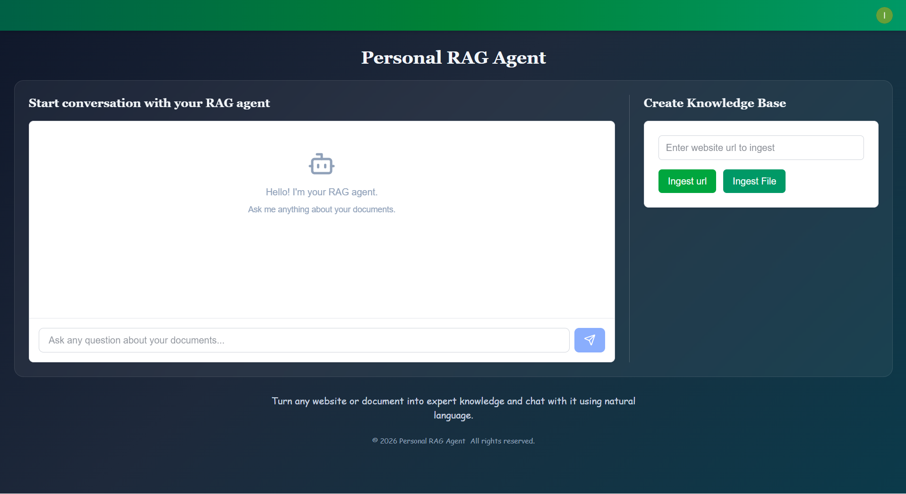
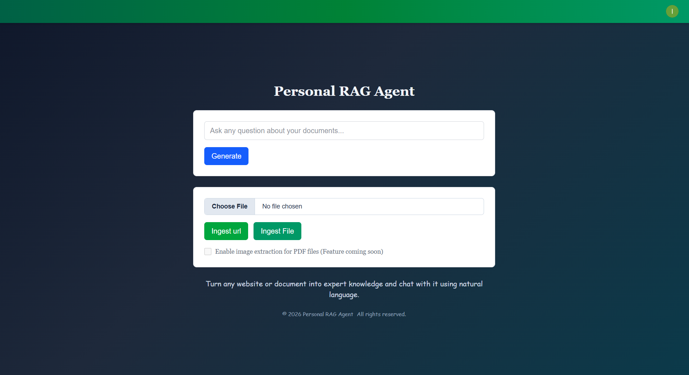

# SaaS Multimodal Agentic RAG App

A Multimodal RAG application, allowing users to ingest URLs and personal documents into expert knowledge and query them through natural language.

End-to-end GenAI application with:
- FastAPI backend + Next.js frontend
- URL and file ingestion into structured knowledge
- Agentic RAG with tool-calling over pgvector
- Clerk authentication
- Langfuse tracing + cost/latency monitoring
- DeepEval-based RAG evaluation

Live AWS deployment: https://m6hkuhagcc.eu-west-1.awsapprunner.com/

## User Interface

<p float="left">
  
  
</p>

## High Level System Design


## Motivation

This project is built as a production-style RAG system, not a demo chatbot:
- Hybrid ingestion for websites, documents, and audio
- Structured storage (`documents` + `chunks`) plus vector search
- Autonomous retrieval strategy via a PydanticAI agent with multiple tools
- Observability and quality gates (logs, traces, eval metrics)
- Containerized deployment path to AWS ECR + App Runner

## High-Level Architecture

```text
User (Next.js + Clerk)
  -> FastAPI endpoints (/api, /ingest, /ingest-file)
    -> Ingestion pipeline
      -> Crawl4AI / Docling / Whisper
      -> Hybrid chunking (Docling HybridChunker)
      -> OpenAI embeddings (text-embedding-3-small)
      -> PostgreSQL + pgvector (documents + chunks)
    -> Agentic RAG (PydanticAI)
      -> search_knowledge_base()
      -> find_all_titles()
      -> find_content_by_title()
    -> Markdown response to UI
Observability: Langfuse traces/spans + usage/cost/latency
Evaluation: DeepEval retrieval + generation metrics
```

## Technology Stack

- Backend: FastAPI, asyncpg, PydanticAI, OpenAI API
- Frontend: Next.js (Pages Router), React, Clerk
- Ingestion: Crawl4AI, Docling (including vision), Whisper ASR
- Data: PostgreSQL, pgvector (`vector(1536)`)
- Observability: Langfuse
- Evaluation: DeepEval
- Containerization: Docker multi-stage build, docker-compose
- Deployment: Amazon ECR + AWS App Runner

## Core Features

### 1) Ingestion Pipeline

#### URL ingestion
- Endpoint: `POST /ingest`
- Crawl4AI crawls the target page(s)
- Attempts sitemap expansion via `<base_url>/sitemap.xml`
- Consolidates crawl output into markdown under `api/documents/`
- Runs the same ingestion pipeline as file uploads

#### File ingestion
- Endpoint: `POST /ingest-file` (multipart)
- Stores upload under `api/documents/`
- Supported formats:
- `.md`, `.markdown`, `.txt`, `.pdf`, `.docx`, `.doc`, `.pptx`, `.ppt`, `.xlsx`, `.xls`, `.html`, `.htm`, `.mp3`, `.wav`, `.m4a`, `.flac`
- UI enforces `<= 5 MB` upload size
- Async background job model:
  - `POST /ingest-file` returns `202` + `job_id`
  - `GET /ingest-file/status/{job_id}` polls status

#### Parsing, Chunking and multimodal support
- Docling converts docs to markdown and emits `DoclingDocument`
- Docling HybridChunker performs structure-aware chunking
- Audio files transcribed with Whisper (via Docling ASR pipeline)
- Optional PDF image extraction: Activating this enables vision model support via docling's `smolvlm_picture_description` library

#### Embeddings + storage
- Embedding model default: `text-embedding-3-small` (1536 dim)
- Stores full document, metadata and chunks in Postgres database

### 2) Agentic RAG

Primary agent implementation: `api/rag_agent.py`

Agent tools:
- `search_knowledge_base(query, limit=5)`: semantic retrieval via `match_chunks()`
- `find_all_titles()`: fetches all document titles
- `find_content_by_title(title)`: reconstructs full document context

Retrieval behavior:
- Agent is instructed to start with semantic search
- It can pivot to title/content tools when full-document context is needed
- Final answer is returned in markdown-friendly text

### 3) Authentication

- Clerk secures key backend routes with Bearer token auth:
- `POST /api`
- `POST /ingest`
- `POST /ingest-file`

## Database Design (PostgreSQL + pgvector)

Schema file: `sql/schema.sql`

### `documents`
| Column       | Type   | Notes |
|-------------|--------|-------|
| `id`        | UUID   | Primary key |
| `title`     | text   |  |
| `source`    | text   |  |
| `content`   | text   |  |
| `metadata`  | JSONB  |  |
| `created_at`| timestamptz | created timestamp |
| `updated_at`| timestamptz | updated timestamp |

---

### `chunks`
| Column        | Type            | Notes |
|--------------|-----------------|------|
| `id`         | UUID            | Primary key |
| `document_id`| UUID            | Foreign key → `documents(id)` **ON DELETE CASCADE** |
| `content`    | text            | chunk text |
| `embedding`  | vector(1536)    | embedding vector |
| `chunk_index`| integer         | order within document |
| `token_count`| integer         | token count for the chunk |
| `metadata`   | JSONB           | chunk-level metadata |
| `created_at` | timestamptz     | created timestamp |

**Relationship:** `documents (1) → (many) chunks`


### Indexes and search function
- `ivfflat` vector index on `chunks.embedding`
- Metadata GIN index on `documents.metadata`
- SQL function `match_chunks(query_embedding, match_count)` returns: chunk content, similarity score, metadata, document title/source

This design enables:
- Fast semantic retrieval
- Provenance-aware responses (title/source)
- Structured fallback retrieval by title/document

## Observability, Logging, Monitoring


### Logging
- Daily rotating backend logs via custom handler
- Files: `api/logs/backend.log.YYYY-MM-DD`

### Langfuse tracing
- End-to-end traces/spans for ingestion and query paths
- Captures tool usage, step-level metadata, and outputs
- Prompt/response storage is environment-controlled
- Sensitive text redaction and payload hashing are built in

### Cost/usage/latency
- Real-time monitoring via Langfuse dashboard

## Evaluation (DeepEval)
RAG Evaluation was conducted using DeepEval, using a custom evaluation dataset.


Metrics used :
- Retrieval: `ContextualPrecisionMetric`, `ContextualRecallMetric`
- Generation: `AnswerRelevancyMetric`, `FaithfulnessMetric`

Evaluation script: `./saas-rag-app/evaluation/eval_retrieval.py`  
Evaluation dataset: `./saas-rag-app/evaluation/evaluation_datasets/rag_eval_dataset_final.csv`  
Evaluation results: `./saas-rag-app/evaluation/eval_results/retrieval_eval_20260212_154806_console.log`

Achieved Pass rates:
- Contextual Precision: `90.24%`
- Contextual Recall: `93.90%`
- Answer Relevancy: `95.12%`
- Faithfulness: `98.78%`

## Local Development

From repo root:

```bash
cd saas-rag-app
```

### 1) Install dependencies

```bash
pip install -r requirements.txt
npm install
```

### 2) Run backend

```bash
uvicorn api.index:app --reload --port 8000
```

### 3) Run frontend

```bash
npm run dev
```

### 4) Access
- Frontend: `http://localhost:3000`
- Backend: `http://localhost:8000`

Note: frontend routes `/api`, `/ingest`, and `/ingest-file/*` are proxied to `http://127.0.0.1:8000` via `next.config.ts`.

## Required Environment Variables

Minimum for local app startup:
- `OPENAI_API_KEY`
- `DATABASE_URL`
- `CLERK_JWKS_URL`
- `NEXT_PUBLIC_CLERK_PUBLISHABLE_KEY`
- `CLERK_SECRET_KEY`
- `SUPABASE_URL`
- `SUPABASE_SERVICE_KEY`

Common optional settings:
- `LLM_MODEL` (default `gpt-4o-mini`)
- `EMBEDDING_MODEL` (default `text-embedding-3-small`)
- `LOG_DIR`, `LOG_LEVEL`
- `LANGFUSE_ENABLED`, `LANGFUSE_PUBLIC_KEY`, `LANGFUSE_SECRET_KEY`, `LANGFUSE_HOST`
- `LANGFUSE_STORE_PROMPTS`, `LANGFUSE_STORE_RESPONSES`, `LANGFUSE_SAMPLE_RATE`

## Evaluation Run

```bash
cd saas-rag-app/evaluation
python eval_retrieval.py
```

Artifacts:
- Dataset: `evaluation/evaluation_datasets/`
- Logs: `evaluation/eval_results/`

## Dockerized Variant

Dockerized app lives in `saas-rag-app-docker/` with:
- Multi-stage Dockerfile (Next static build + FastAPI runtime)
- Health endpoint (`/health`)
- Static frontend served by FastAPI
- `docker-compose.yml`

Run locally:

```bash
cd saas-rag-app-docker
docker compose up --build
```

Then open:
- App (UI + API): `http://localhost:8000`

## AWS Deployment (ECR + App Runner)

High-level deployment process used:
1. Built Docker image from `saas-rag-app-docker/`.
2. Pushed image to Amazon ECR.
3. Configured AWS App Runner service from ECR image.
4. Set up runtime environment variables in App Runner.
5. Deployed and validated end-to-end functionality on AWS.

## Repository Structure

```text
saas-rag-app/
  api/
    index.py                     # FastAPI endpoints
    rag_agent.py                 # Agentic RAG tools + agent
    file_data_ingestion/ingest.py
    utils/                       # db, logging, providers, observability
  pages/index.tsx                # Main Next.js UI
  sql/schema.sql                 # Postgres schema + match_chunks()
  evaluation/                    # DeepEval scripts, datasets, logs

saas-rag-app-docker/             # Dockerized deployment variant
saas-rag-app-vercel/             # Alternate vercel variant (not live)
```

## Deployment Note

Current AWS deployment is intentionally lightweight to optimize cost/infra.
- Included: core RAG flow
- Temporarily excluded: full audio and PDF image-extraction pipeline

Full multimodal capabilities are available in local/dev setup and planned for broader deployment rollout.
